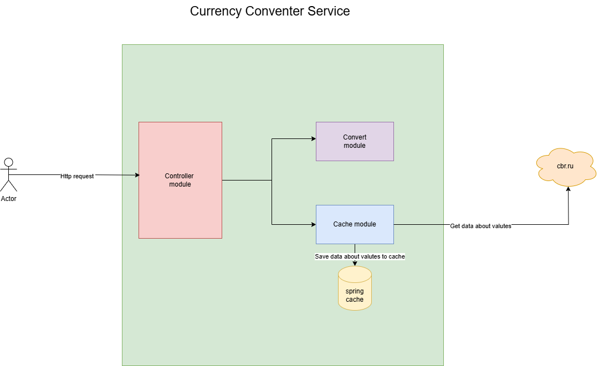

# Currency сonverter
___
## Description
This is pet-project CurrencyConverter service.  
Service can:
1. Shows current curse of valutes 
2. Converts one amount of valute to another.
3. Show info about specific valute
___
## Architect

___
## Resources
1. POST /curse   
Body `{
   "from":"Азербайджанский манат",
   "to":"Австралийский доллар"
   }`
2. POST /convert   
   Body `{
   "from":"Азербайджанский манат",
   "from_amount":"100",
   "to":"Австралийский доллар"
   }`
3. GET /{name_of_valute}
